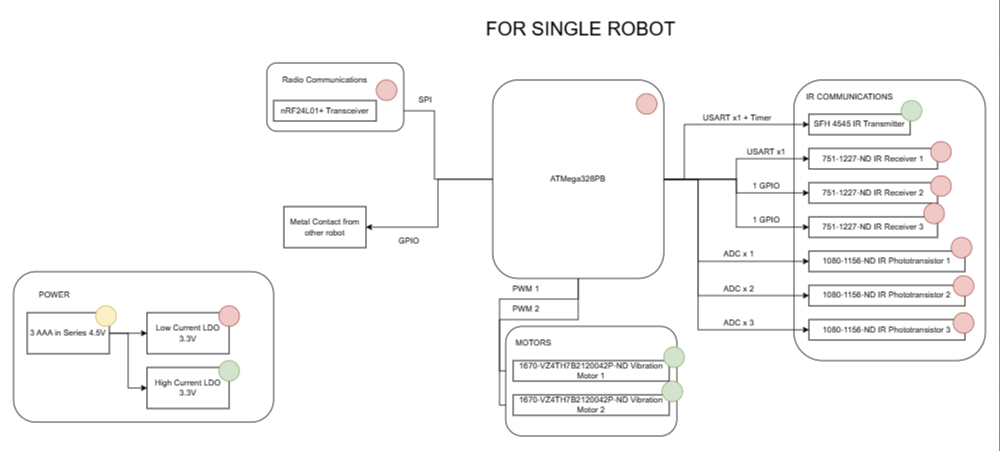
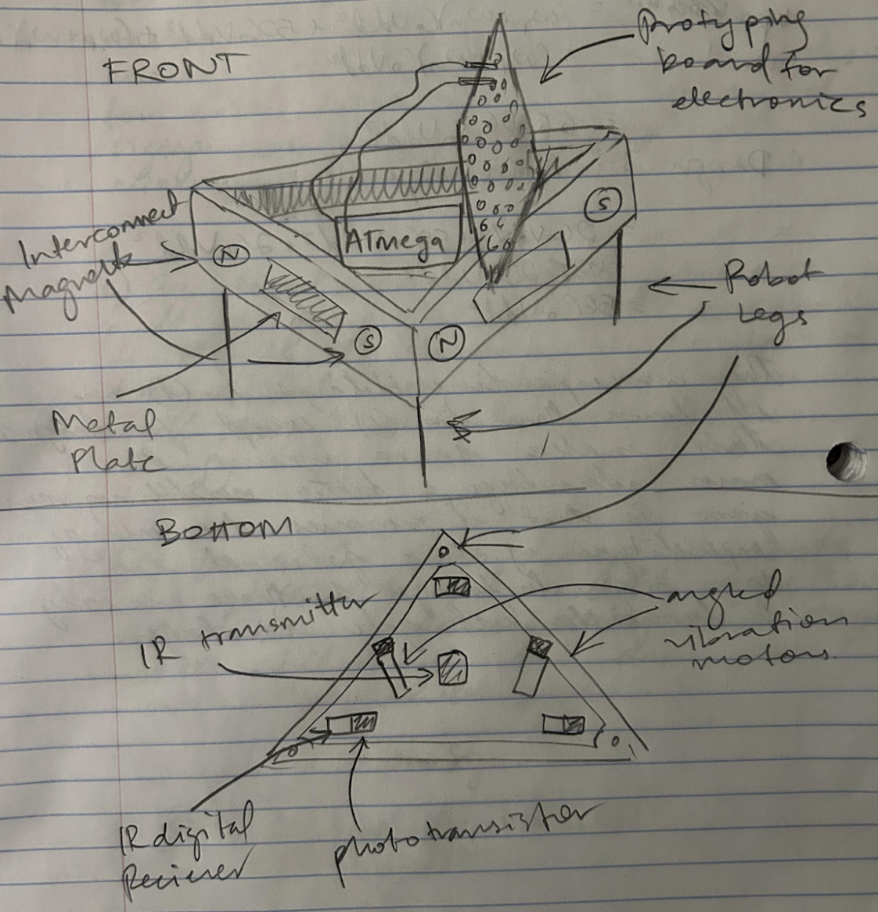

# Final Project

**Team Number: 9**

**Team Name: 10**

| Team Member Name | Email Address          |
| ---------------- | ---------------------- |
| Ronil Laad       | rlaad@seas.upenn.edu   |
| Veer Kakar       | vkakar@seas.upenn.edu  |
| Kevin Song       | ksong37@seas.upenn.edu |

**GitHub Repository URL: [https://github.com/upenn-embedded/final-project-s26-t9](https://github.com/upenn-embedded/final-project-s26-t9)**

**GitHub Pages Website URL:** [for final submission]*

## Final Project Proposal

### 1. Abstract

We are using swarm robotics, where we have one central processing unit and a couple smaller robots on the ground, to assemble specific shape(s) given any starting position and orientation. They will have triangles on top of them to form these 2D shapes, and each one will communicate wirelessly with our main processing unit to correct themselves and determine how to assemble themselves.

### 2. Motivation

Given robots at arbitrary starting positions and orientations, our goal is to collectively assemble them into a target 2D shape with no manual intervention. This is difficult because each robot must receive real-time positional corrections over a wireless link and execute precise movements to reach its designated slot in the formation. The intended purpose is to demonstrate a scalable and fault tolerant working proof-of-concept for decentralized shape assembly/disassembly, with direct applications in manufacturing (flexible, reconfigurable automation), search-and-rescue (deploying many cheap agents across a disaster zone), and space exploration (redundant rover swarms where individual failures are acceptable).

### 3. System Block Diagram

### 4. Design Sketches

Each robot is triangular, with the ATmega and a prototyping board for electronics mounted on top. The triangle form factor allows three distinct faces, each carrying an interconnect magnet and a metal plate for connection detection with adjacent robots. Short robot legs elevate the body off the floor.

On the bottom, the IR transmitter is centered and fires to transmit the signal. Each of the three faces has an IR digital receiver and a phototransistor to capture the reflected signal. Two vibration motors are mounted at angles on the underside to enable directional movement through differential activation.

No special manufacturing is required. The chassis can be 3D printed, with components hand-soldered onto a perfboard.

### 5. Software Requirements Specification (SRS)

**5.1 Definitions, Abbreviations**

- **MCU**: Microcontroller Unit
- **IR**: Infrared
- **RSSI**: Received Signal Strength Indicator (here, ambient-corrected IR brightness used as a proxy for inter-robot distance)
- **Radio**: The wireless transceiver module used for communication between robots and the main MCU

**5.2 Functionality**

| ID     | Description                                                                                                                                                                                                                                                                                                                                                   |
| ------ | ------------------------------------------------------------------------------------------------------------------------------------------------------------------------------------------------------------------------------------------------------------------------------------------------------------------------------------------------------------- |
| SRS-01 | Each robot shall be capable of moving in at least 4 distinct directions (forward, backward, left, right) by independently controlling its vibration motors. Validation: command each direction and confirm correct motion visually and by observing displacement.                                                                                             |
| SRS-02 | Each robot shall measure the ambient IR level using a photoresistor immediately before transmitting its IR signal, subtract the ambient value from the received signal strength, and report a corrected inter-robot distance within ±1 cm. Validation: compare reported distances against a ruler at known separations (1, 3, 5, etc. cm).                  |
| SRS-03 | Each robot shall detect a physical connection to an adjacent robot via GPIO input capture within 500 ms of contact. Validation: manually connect robots and confirm a connection-detected flag is set within the time bound, logged to terminal.                                                                                                              |
| SRS-04 | Each robot shall transmit its sensor data (IR distance readings, connection state) to the main MCU over the radio link within 200 ms of being polled. Validation: log timestamps of poll and receipt on both sides and confirm the latency bound is met across 20 trials.                                                                                     |
| SRS-05 | The main MCU shall poll each robot one at a time, receive its data, and construct a graph of relative robot positions (nodes = robots, edges = adjacent pairs, edge weights = corrected IR distance) within 1 second of initiating a polling cycle. Validation: print the adjacency graph to a terminal and verify correctness against known physical layout. |
| SRS-06 | The main MCU path-planning algorithm shall compute a valid movement instruction set for all robots to reach their target shape positions and transmit those instructions within 3 seconds of completing graph construction. Validation: log computed instructions and measure time from graph completion to first instruction sent.                           |
| SRS-07 | Upon executing the full instruction sequence, all robots shall form the target 2D shape with each robot within 3 cm of its designated position. Validation: observe the final configuration visually and measure positional error for each robot against the intended layout.                                                                                 |

### 6. Hardware Requirements Specification (HRS)

**6.1 Definitions, Abbreviations**

- **IR**: Infrared
- **LDO**: Low Dropout Regulator
- **ADC**: Analog-to-Digital Converter
- **GPIO**: General Purpose Input/Output
- **SPI**: Serial Peripheral Interface

**6.2 Functionality**

| ID     | Description                                                                                                                                                                                                                                                                                                                     |
| ------ | ------------------------------------------------------------------------------------------------------------------------------------------------------------------------------------------------------------------------------------------------------------------------------------------------------------------------------- |
| HRS-01 | Each vibration motor shall produce sufficient force to displace the robot on a hard, flat surface in a commanded direction within 0.5 seconds of activation. Validation: activate each motor individually and in combination on a hard floor and confirm directional displacement.                                              |
| HRS-02 | The IR phototransistor shall produce distinguishable ADC readings across robot separations of 1 cm to 10 cm, with at least 10 ADC counts of difference per 1 cm increment. Validation: place two robots at known distances and record ADC values, verifying monotonic change with distance.                                     |
| HRS-03 | The nRF24L01+ radio transceiver shall maintain reliable packet communication (less than 5% packet loss) at a range of at least 5 meters. Validation: send 100 packets at 5 m separation and count dropped packets.                                                                                                              |
| HRS-04 | The neodymium magnets shall hold two connected robots together under normal vibration motor operation, but allow separation when both motors on one robot are driven at full power. Validation: connect two robots and confirm they remain joined during normal motion, then drive motors at full power and confirm separation. |
| HRS-05 | The conductive connection plates shall produce a GPIO logic HIGH on the receiving robot within 200 ms of physical contact between two robot faces. Validation: manually press two robot faces together and measure time from contact to GPIO flag via oscilloscope or terminal log.                                             |
| HRS-06 | The two LDOs shall maintain stable 3.3V output under full load (all motors and radio active simultaneously) with less than 100 mV of ripple. Validation: measure output voltage with a multimeter and oscilloscope while running all components simultaneously.                                                                 |
| HRS-07 | The battery supply (3x AAA) shall sustain full system operation for at least 10 minutes without voltage dropping below 3.6V at the LDO inputs. Validation: run all components continuously and log supply voltage over time.                                                                                                    |

### 7. Bill of Materials (BOM)

**Communication**

Robots need to communicate their IDs and distance/direction estimates to each other and receive movement instructions from the central MCU. For inter-robot sensing, each robot has one IR transmitter on its bottom that emits a signal reflected off the floor, received by three IR receivers on the faces of nearby robots. Since IR receivers only output a digital signal, each receiver is paired with a phototransistor fed into an ADC pin on the ATmega to measure signal strength, which is converted to distance. For central MCU-to-robot communication, we use the nRF24L01+ radio transceiver over SPI, as radio is better suited here since instructions are complex and IR would be physically impractical at range. The nRF24L01+ handles the radio layer, leaving all processing to the ATmega.

**Locomotion**

We use two cylindrical vibration motors per robot. The robots are small, so power draw must be minimal, as traditional motors would be too large and power-hungry. The focus of this project is the motion coordination and communication protocols, not raw speed, so vibration motors are sufficient. Differential control of the two motors drives the robot in different directions.

**Inter-robot Connection**

Robots need to physically connect to form larger structures. Rather than a complex mechanical latch, we use low-strength neodymium magnets on each face, strong enough to hold robots together as a collective but weak enough for vibration motors to overcome when separation is needed. Connection detection is done by placing conductive plates next to the magnets: one robot holds a plate at voltage, and the adjacent robot reads the plate via GPIO to detect a non-zero voltage, indicating successful contact. Any conductive material (e.g., aluminum foil) works for the plates, so they are not included in the BOM.

**BOM:** [ESE3500 S26 Final Project BOM Spreadsheet](https://docs.google.com/spreadsheets/d/1dAN4z8ll3DWlfVrHKkv8GovNzbABgyyJaMT6Ls-GGos/edit?usp=drive_web&ouid=110902551246044778519)

### 8. Final Demo Goals

We will place the swarm robots at random positions and orientations on the floor of an open room, with the MCU control unit stationed separately. A shape command will be sent to the MCU, which will then wirelessly coordinate the robots to autonomously assemble into the target 2D shape from their arbitrary starting configuration, with no manual intervention after the initial command.

The demo will be conducted on a hard, flat floor to ensure consistent vibration motor movement. The room should have controlled lighting to minimize IR interference beyond what the ambient photoresistor correction can handle. The MCU must remain within wireless range of all robots throughout the demo. Because motors are imprecise and movement timing varies, the MCU may need to re-poll and re-plan for multiple iterations rather than issuing a fixed instruction sequence.

### 9. Sprint Planning

| Milestone  | Functionality Achieved                                                                                                                                                                                                     | Distribution of Work                                                                                                                                                              |
| ---------- | -------------------------------------------------------------------------------------------------------------------------------------------------------------------------------------------------------------------------- | --------------------------------------------------------------------------------------------------------------------------------------------------------------------------------- |
| Sprint #1  | PCB designed and ordered; individual components tested: vibration motors respond to PWM, IR phototransistors produce varying ADC readings at different distances, nRF24L01+ sends and receives packets between two ATmegas | Ronil: PCB schematic and layout; Veer: motor PWM control firmware; Kevin: IR sensing and ADC calibration                                                                          |
| Sprint #2  | Single robot fully functional: moves in commanded directions, measures IR distances to a nearby robot, detects physical connection via conductive plates, and exchanges data with main MCU over radio                      | Ronil: radio communication protocol (polling and data format); Veer: motion control algorithm (direction and speed mapping); Kevin: IR ambient correction and distance estimation |
| MVP Demo   | Two robots controllable from main MCU: MCU polls both, constructs a 2-node graph, and commands them to reach a target relative position                                                                                    | Ronil: motion testing; Veer: Graph construction and testing; Kevin: path planning for 2-robot case                                                                                |
| Final Demo | Full swarm (6+ robots) assembles a target 2D shape from arbitrary starting positions with no manual intervention after initial command                                                                                     | All: full system integration, edge case handling, and demo rehearsal                                                                                                              |

**This is the end of the Project Proposal section. The remaining sections will be filled out based on the milestone schedule.**

## Sprint Review #1

### Last week's progress

### Current state of project

### Next week's plan

## Sprint Review #2

### Last week's progress

### Current state of project

### Next week's plan

## MVP Demo

## Final Report

Don't forget to make the GitHub pages public website!
If you’ve never made a GitHub pages website before, you can follow this webpage (though, substitute your final project repository for the GitHub username one in the quickstart guide):  [https://docs.github.com/en/pages/quickstart](https://docs.github.com/en/pages/quickstart)

### 1. Video

### 2. Images

### 3. Results

#### 3.1 Software Requirements Specification (SRS) Results

| ID     | Description                                                                                               | Validation Outcome                                                                          |
| ------ | --------------------------------------------------------------------------------------------------------- | ------------------------------------------------------------------------------------------- |
| SRS-01 | The IMU 3-axis acceleration will be measured with 16-bit depth every 100 milliseconds +/-10 milliseconds. | Confirmed, logged output from the MCU is saved to "validation" folder in GitHub repository. |

#### 3.2 Hardware Requirements Specification (HRS) Results

| ID     | Description                                                                                                                        | Validation Outcome                                                                                                      |
| ------ | ---------------------------------------------------------------------------------------------------------------------------------- | ----------------------------------------------------------------------------------------------------------------------- |
| HRS-01 | A distance sensor shall be used for obstacle detection. The sensor shall detect obstacles at a maximum distance of at least 10 cm. | Confirmed, sensed obstacles up to 15cm. Video in "validation" folder, shows tape measure and logged output to terminal. |
|        |                                                                                                                                    |                                                                                                                         |

### 4. Conclusion

## References
