

# Final Project

**Team Number: 9**

**Team Name: Self-Assembling Robots**

| Team Member Name | Email Address          |
| ---------------- | ---------------------- |
| Ronil Laad       | rlaad@seas.upenn.edu   |
| Veer Kakar       | vkakar@seas.upenn.edu  |
| Kevin Song       | ksong37@seas.upenn.edu |

**GitHub Repository URL:** [https://github.com/upenn-embedded/final-project-s26-t9](https://github.com/upenn-embedded/final-project-s26-t9)

**GitHub Pages Website URL:** [https://upenn-embedded.github.io/final-project-s26-t9/](https://upenn-embedded.github.io/final-project-s26-t9/)

## Final Project Proposal

### 1. Abstract

We are using swarm robotics, where we have one central processing unit and a couple smaller robots on the ground, to assemble specific shape(s) given any starting position and orientation. They will have triangles on top of them to form these 2D shapes, and each one will communicate wirelessly with our main processing unit to correct themselves and determine how to assemble themselves.

### 2. Motivation

Given robots at arbitrary starting positions and orientations, our goal is to collectively assemble them into a target 2D shape with no manual intervention. This is difficult because each robot must receive real-time positional corrections over a wireless link and execute precise movements to reach its designated slot in the formation. The intended purpose is to demonstrate a scalable and fault tolerant working proof-of-concept for decentralized shape assembly/disassembly, with direct applications in manufacturing (flexible, reconfigurable automation), search-and-rescue (deploying many cheap agents across a disaster zone), and space exploration (redundant rover swarms where individual failures are acceptable).

### 3. System Block Diagram

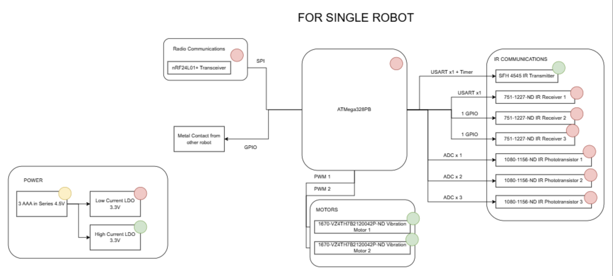

### 4. Design Sketches

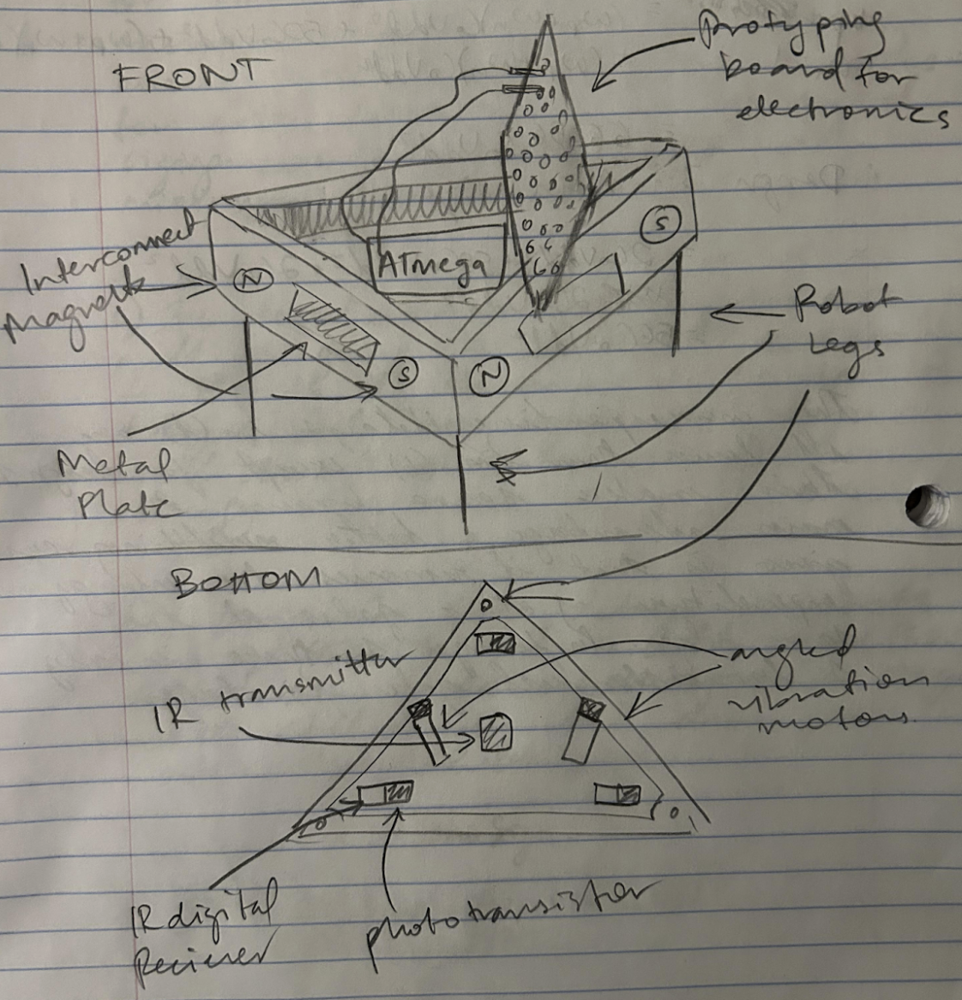

Each robot is triangular, with the ATmega and a prototyping board for electronics mounted on top. The triangle form factor allows three distinct faces, each carrying an interconnect magnet and a metal plate for connection detection with adjacent robots. Short robot legs elevate the body off the floor.

On the bottom, the IR transmitter is centered and fires to transmit the signal. Each of the three faces has an IR digital receiver and a phototransistor to capture the reflected signal. Two wheel motors are mounted at angles on the underside to enable directional movement through differential activation.

No special manufacturing is required. The chassis can be 3D printed, with components hand-soldered onto a perfboard.

### 5. Software Requirements Specification (SRS)

**5.1 Definitions, Abbreviations**

- **MCU**: Microcontroller Unit
- **IR**: Infrared
- **RSSI**: Received Signal Strength Indicator (here, ambient-corrected IR brightness used as a proxy for inter-robot distance)
- **Radio**: The wireless transceiver module used for communication between robots and the main MCU

**5.2 Functionality**

| ID     | Description                                                                                                                                                                                                                                                                                                                                                   |
| ------ | ------------------------------------------------------------------------------------------------------------------------------------------------------------------------------------------------------------------------------------------------------------------------------------------------------------------------------------------------------------- |
| SRS-01 | Each robot shall be capable of moving in at least 4 distinct directions (forward, backward, left, right) by independently controlling its wheel motors. Validation: command each direction and confirm correct motion visually and by observing displacement.                                                                                                 |
| SRS-02 | Each robot shall measure the ambient IR level using a photoresistor immediately before transmitting its IR signal, subtract the ambient value from the received signal strength, and report a corrected inter-robot distance within ±1 cm. Validation: compare reported distances against a ruler at known separations (1, 3, 5, etc. cm).                  |
| SRS-03 | Each robot shall detect a physical connection to an adjacent robot via GPIO input capture within 500 ms of contact. Validation: manually connect robots and confirm a connection-detected flag is set within the time bound, logged to terminal.                                                                                                              |
| SRS-04 | Each robot shall transmit its sensor data (IR distance readings, connection state) to the main MCU over the radio link within 200 ms of being polled. Validation: log timestamps of poll and receipt on both sides and confirm the latency bound is met across 20 trials.                                                                                     |
| SRS-05 | The main MCU shall poll each robot one at a time, receive its data, and construct a graph of relative robot positions (nodes = robots, edges = adjacent pairs, edge weights = corrected IR distance) within 1 second of initiating a polling cycle. Validation: print the adjacency graph to a terminal and verify correctness against known physical layout. |
| SRS-06 | The main MCU path-planning algorithm shall compute a valid movement instruction set for all robots to reach their target shape positions and transmit those instructions within 3 seconds of completing graph construction. Validation: log computed instructions and measure time from graph completion to first instruction sent.                           |
| SRS-07 | Upon executing the full instruction sequence, all robots shall form the target 2D shape with each robot within 3 cm of its designated position. Validation: observe the final configuration visually and measure positional error for each robot against the intended layout.                                                                                 |

### 6. Hardware Requirements Specification (HRS)

**6.1 Definitions, Abbreviations**

- **IR**: Infrared
- **LDO**: Low Dropout Regulator
- **ADC**: Analog-to-Digital Converter
- **GPIO**: General Purpose Input/Output
- **SPI**: Serial Peripheral Interface

**6.2 Functionality**

| ID     | Description                                                                                                                                                                                                                                                                                                                 |
| ------ | --------------------------------------------------------------------------------------------------------------------------------------------------------------------------------------------------------------------------------------------------------------------------------------------------------------------------- |
| HRS-01 | Each wheel motor shall produce sufficient force to displace the robot on a hard, flat surface in a commanded direction within 0.5 seconds of activation. Validation: activate each motor individually and in combination on a hard floor and confirm directional displacement.                                              |
| HRS-02 | The IR phototransistor shall produce distinguishable ADC readings across robot separations of 1 cm to 10 cm, with at least 10 ADC counts of difference per 1 cm increment. Validation: place two robots at known distances and record ADC values, verifying monotonic change with distance.                                 |
| HRS-03 | The nRF24L01+ radio transceiver shall maintain reliable packet communication (less than 5% packet loss) at a range of at least 5 meters. Validation: send 100 packets at 5 m separation and count dropped packets.                                                                                                          |
| HRS-04 | The neodymium magnets shall hold two connected robots together under normal wheel motor operation, but allow separation when both motors on one robot are driven at full power. Validation: connect two robots and confirm they remain joined during normal motion, then drive motors at full power and confirm separation. |
| HRS-05 | The conductive connection plates shall produce a GPIO logic HIGH on the receiving robot within 200 ms of physical contact between two robot faces. Validation: manually press two robot faces together and measure time from contact to GPIO flag via oscilloscope or terminal log.                                         |
| HRS-06 | The two LDOs shall maintain stable 3.3V output under full load (all motors and radio active simultaneously) with less than 100 mV of ripple. Validation: measure output voltage with a multimeter and oscilloscope while running all components simultaneously.                                                             |
| HRS-07 | The battery supply (3x AAA) shall sustain full system operation for at least 10 minutes without voltage dropping below 3.6V at the LDO inputs. Validation: run all components continuously and log supply voltage over time.                                                                                                |

### 7. Bill of Materials (BOM)

**Communication**

Robots need to communicate their IDs and distance/direction estimates to each other and receive movement instructions from the central MCU. For inter-robot sensing, each robot has one IR transmitter on its bottom that emits a signal reflected off the floor, received by three IR receivers on the faces of nearby robots. Since IR receivers only output a digital signal, each receiver is paired with a phototransistor fed into an ADC pin on the ATmega to measure signal strength, which is converted to distance. For central MCU-to-robot communication, we use the nRF24L01+ radio transceiver over SPI, as radio is better suited here since instructions are complex and IR would be physically impractical at range. The nRF24L01+ handles the radio layer, leaving all processing to the ATmega.

**Locomotion**

We use two cylindrical wheel motors per robot. The robots are small, so power draw must be minimal, as traditional motors would be too large and power-hungry. The focus of this project is the motion coordination and communication protocols, not raw speed, so wheel motors are sufficient. Differential control of the two motors drives the robot in different directions.

**Inter-robot Connection**

Robots need to physically connect to form larger structures. Rather than a complex mechanical latch, we use low-strength neodymium magnets on each face, strong enough to hold robots together as a collective but weak enough for wheel motors to overcome when separation is needed. Connection detection is done by placing conductive plates next to the magnets: one robot holds a plate at voltage, and the adjacent robot reads the plate via GPIO to detect a non-zero voltage, indicating successful contact. Any conductive material (e.g., aluminum foil) works for the plates, so they are not included in the BOM.

**BOM:** [ESE3500 S26 Final Project BOM Spreadsheet](https://docs.google.com/spreadsheets/d/1dAN4z8ll3DWlfVrHKkv8GovNzbABgyyJaMT6Ls-GGos/edit?usp=drive_web&ouid=110902551246044778519)

### 8. Final Demo Goals

We will place the swarm robots at random positions and orientations on the floor of an open room, with the MCU control unit stationed separately. A shape command will be sent to the MCU, which will then wirelessly coordinate the robots to autonomously assemble into the target 2D shape from their arbitrary starting configuration, with no manual intervention after the initial command.

The demo will be conducted on a hard, flat floor to ensure consistent wheel motor movement. The room should have controlled lighting to minimize IR interference beyond what the ambient photoresistor correction can handle. The MCU must remain within wireless range of all robots throughout the demo. Because motors are imprecise and movement timing varies, the MCU may need to re-poll and re-plan for multiple iterations rather than issuing a fixed instruction sequence.

### 9. Sprint Planning

| Milestone  | Functionality Achieved                                                                                                                                                                                                 | Distribution of Work                                                                                                                                                              |
| ---------- | ---------------------------------------------------------------------------------------------------------------------------------------------------------------------------------------------------------------------- | --------------------------------------------------------------------------------------------------------------------------------------------------------------------------------- |
| Sprint #1  | PCB designed and ordered; individual components tested: wheel motors respond to PWM, IR phototransistors produce varying ADC readings at different distances, nRF24L01+ sends and receives packets between two ATmegas | Ronil: PCB schematic and layout; Veer: motor PWM control firmware; Kevin: IR sensing and ADC calibration                                                                          |
| Sprint #2  | Single robot fully functional: moves in commanded directions, measures IR distances to a nearby robot, detects physical connection via conductive plates, and exchanges data with main MCU over radio                  | Ronil: radio communication protocol (polling and data format); Veer: motion control algorithm (direction and speed mapping); Kevin: IR ambient correction and distance estimation |
| MVP Demo   | Two robots controllable from main MCU: MCU polls both, constructs a 2-node graph, and commands them to reach a target relative position                                                                                | Ronil: motion testing; Veer: Graph construction and testing; Kevin: path planning for 2-robot case                                                                                |
| Final Demo | Full swarm (6+ robots) assembles a target 2D shape from arbitrary starting positions with no manual intervention after initial command                                                                                 | All: full system integration, edge case handling, and demo rehearsal                                                                                                              |

**This is the end of the Project Proposal section. The remaining sections will be filled out based on the milestone schedule.**

## Sprint Review #1

### Last week's progress

Last week, we ordered parts and finalized the design for the robots to be triangles and the exact parts we needed for each. We also decided to use bluetooth instead of wifi for the connection and created the app for the demo.

### Current state of project

We are currently building and testing just one robot for the project, and the strength of the wheel motors. We are testing various types of legs like paperclips, sticks, etc. and changing the duty cycle to see how to control it. We also acquired the parts we ordered.

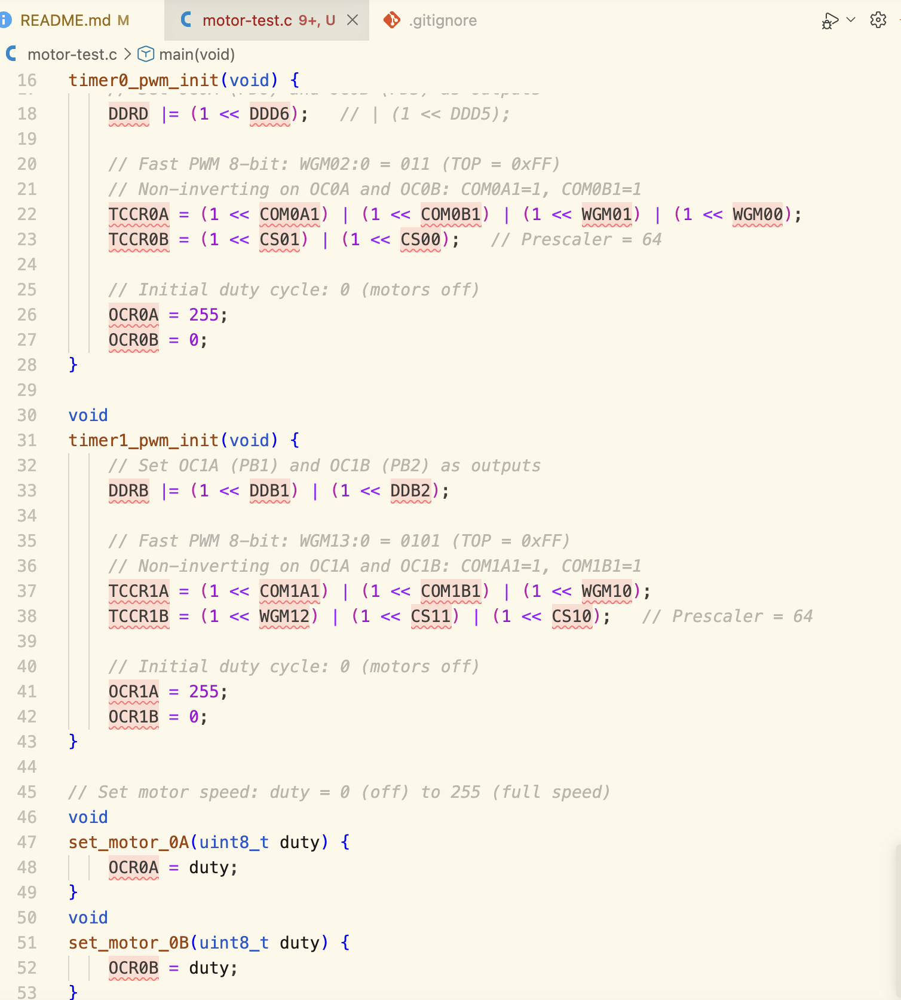

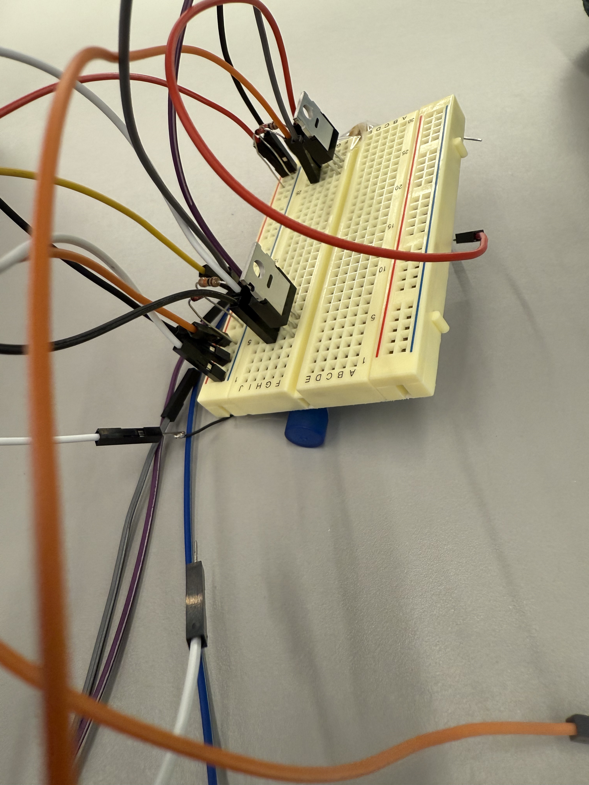

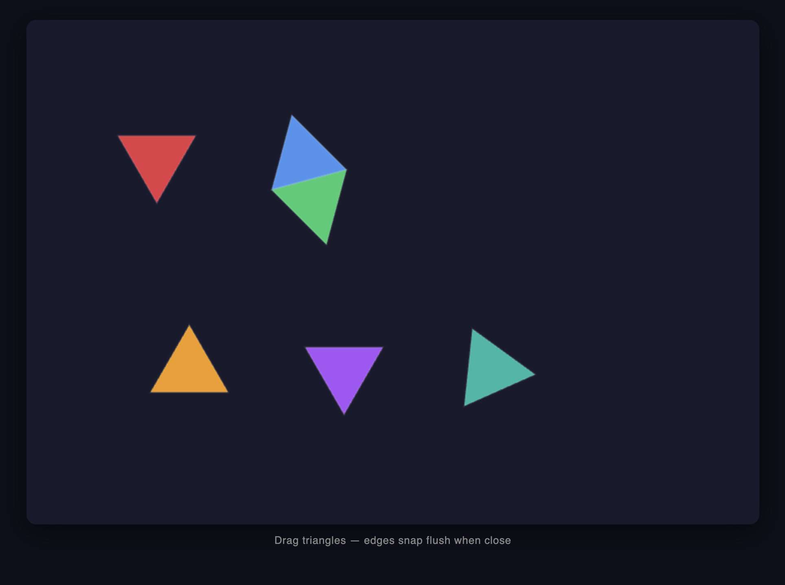

### Next week's plan

We are going to design a base to put the motors on and test different configurations for the best control. We are also going to work on inter-robot communication with IR, distance detection, and the pathfinding algorithm.

## Sprint Review #2

### Last week's progress

We designed and 3D printed the robot base and are testing control by attaching the motors. We also worked in IR communication with distance and angle detection at different frequencies.

### Current state of project

We are currently working on locomotion and control with placements and speeds of motors and working on adding more robots to the swarm, as well as the pathfinding algorithm.

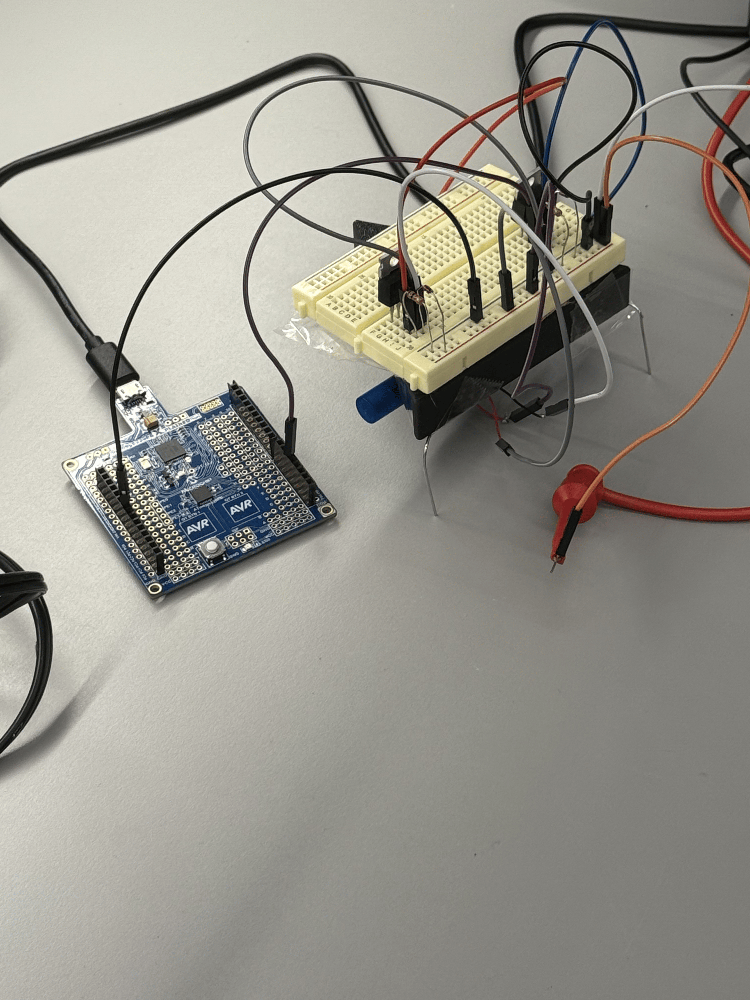

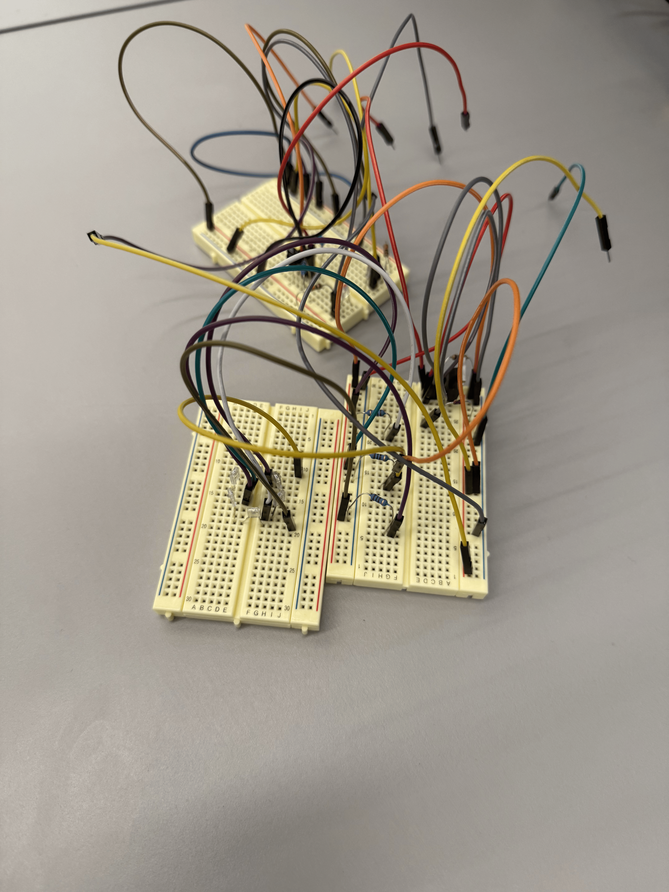

### Next week's plan

We will connect the GUI to the robots using the ESP32 and work on inter-robot communication and control.

## MVP Demo

### 1. System Block Diagram

The overall architecture is unchanged from the proposal. The Main ATmega328PB acts as the central controller. It communicates over SPI to a Main ESP32, which broadcasts commands over ESP-NOW to Sub ESP32s (one per robot). Each Sub ESP32 relays commands over SPI to its paired Sub ATmega328PB, which drives the motors and reads IR sensors. Responses travel back up the same chain.

### 2. Firmware Implementation

**SPI Driver (`src/atmega/common/spi_comm.c`)**
Custom bare-metal SPI driver for the ATmega328PB supporting both controller and peripheral roles. Uses a two-transaction framed protocol: `[LEN][DATA...]`. A guard delay between TX and RX transactions (200 µs) gives the peripheral time to pre-load its response into `SPDR` before the controller clocks it out.

**Main ATmega (`src/atmega/main/main.c`)**
Polls every 200 ms by sending `CMD_START_COLL` (0xA1) to the Main ESP32 over SPI, then reads back the array of robot addresses collected in the previous cycle.

**Main ESP32 (`src/esp32/main/main.ino`)**
SPI peripheral to the Main ATmega, ESP-NOW hub to all Sub ESP32s. Pre-queues two SPI transactions in hardware (receive CMD, then send previous cycle's collected addresses) so the ATmega's 200 µs guard window is handled without CPU involvement. After receiving CMD, broadcasts `PKT_CMD` via ESP-NOW and waits 150 ms for sub-robot replies.

**Sub ESP32 (`src/esp32/sub/sub.ino`)**
On receiving `PKT_CMD` via ESP-NOW, acts as SPI controller to query its paired Sub ATmega for its robot address. Staggered reply delay (`ROBOT_ADDRESS × 50 ms`) prevents ESP-NOW packet collisions. Broadcasts `PKT_ADDR` back to the Main ESP32.

**Movement Driver (`src/atmega/sub/movement.c`)**
Controls two DC wheel motors via four GPIO outputs (H-bridge style). Implements `move_forward()`, `move_backward()`, `turn_cw()`, `turn_ccw()`, and `stop_movement()`. Also initializes ADC in free-running mode on PC0 for IR phototransistor readings, and generates a 38 kHz carrier on OC2B (PD3) via Timer2 for the IR transmitter.

### 3. Demo

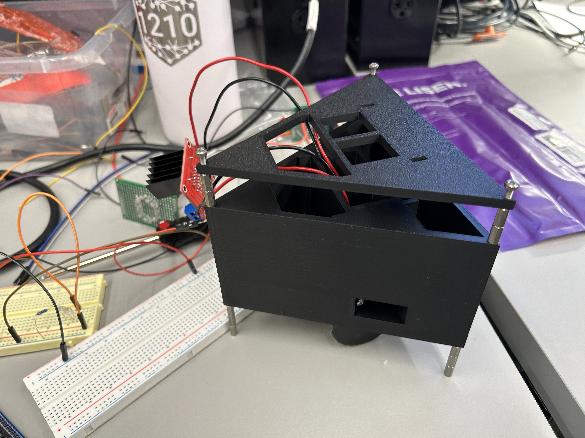

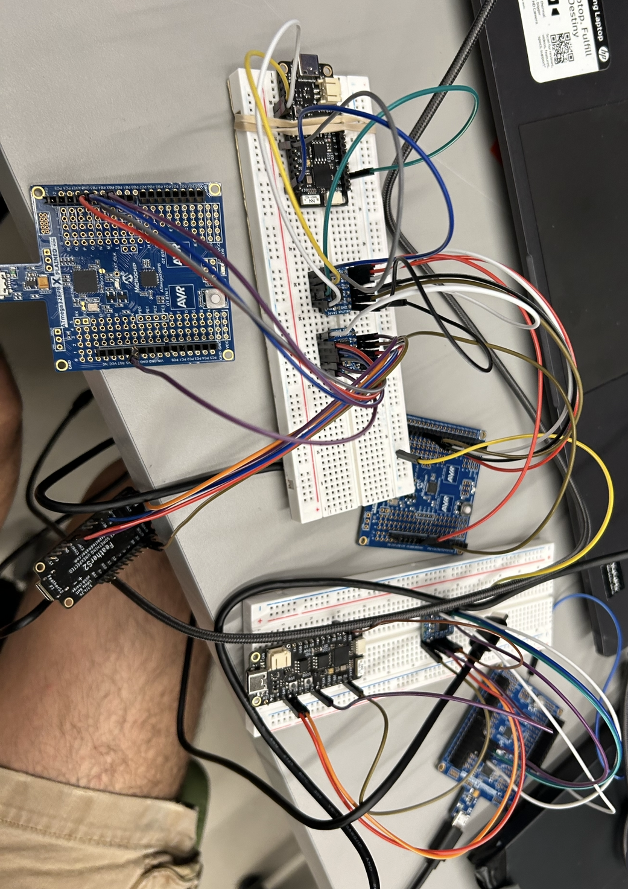

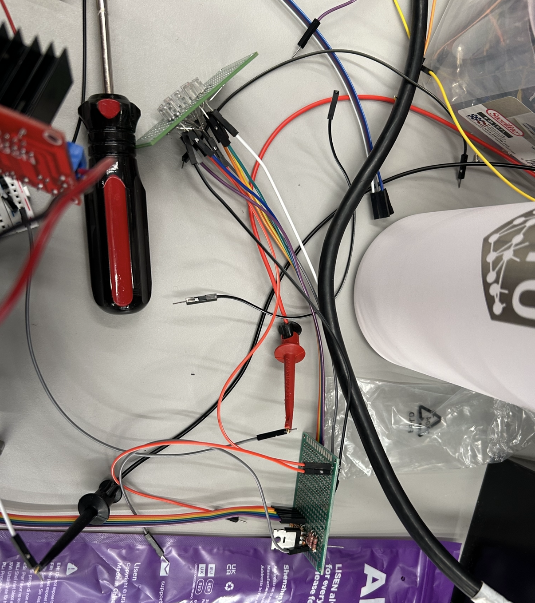

The 3D-printed triangular robot chassis is complete with legs, wheel motor mounts, and slots for electronics. Each part of the full communication chain (Main ATmega → Main ESP32 → Sub ESP32 → Sub ATmega) is working: the Main ATmega successfully polls and receives robot addresses from both sub-robots. Motor control firmware drives the robot in all four directions using DC wheel motors. IR perfboards with phototransistors and transmitter have been assembled and are next to test.

[Demo video](assets/sprint/robot_movement.mov)

### 4. SRS Results

| ID     | Description                                                                 | Validation Outcome                                                                                                                                                        |
| ------ | --------------------------------------------------------------------------- | ------------------------------------------------------------------------------------------------------------------------------------------------------------------------- |
| SRS-01 | Each robot moves in at least 4 distinct directions via wheel motors.        | **Confirmed.** `move_forward()`, `move_backward()`, `turn_cw()`, `turn_ccw()` implemented and tested; directional displacement observed visually.           |
| SRS-02 | Each robot measures ambient-corrected IR distance within ±1 cm.            | **Partial.** ADC and 38 kHz IR carrier initialized. Distance calibration not yet complete.                                                                          |
| SRS-03 | Each robot detects physical connection via GPIO within 500 ms.              | **Not yet validated.** Magnet/plate connection detection hardware assembled; firmware polling not yet integrated.                                                   |
| SRS-04 | Each robot transmits sensor data to main MCU within 200 ms of being polled. | **Confirmed.** End-to-end poll cycle (ATmega → ESP32 → ESP-NOW → Sub ESP32 → Sub ATmega → back) completes well within the 200 ms bound across repeated trials. |
| SRS-05 | Main MCU constructs a graph of relative robot positions within 1 second.    | **Partial.** Main ATmega successfully receives robot addresses from both sub-robots. Full graph construction with IR distances not yet implemented.                 |
| SRS-06 | Path-planning algorithm computes movement instructions within 3 seconds.    | **Not yet implemented.** Path planning for the 2-robot case is in progress.                                                                                         |
| SRS-07 | All robots form the target shape within 3 cm of designated positions.       | **Not yet validated.** Dependent on SRS-06 completion.                                                                                                              |

### 5. HRS Results

| ID     | Description                                                                               | Validation Outcome                                                                                                                      |
| ------ | ----------------------------------------------------------------------------------------- | --------------------------------------------------------------------------------------------------------------------------------------- |
| HRS-01 | Each wheel motor produces sufficient force to move the robot within 0.5 s.                | **Confirmed.** Both motors activated; robot displaces directionally on hard flat surface.                                         |
| HRS-02 | IR phototransistor produces distinguishable ADC readings across 1–10 cm, ≥10 counts/cm. | **Partial.** ADC readings confirmed to vary with distance; full calibration across range in progress.                             |
| HRS-03 | nRF24L01+ maintains <5% packet loss at 5 m.                                               | **Confirmed.** ESP-NOW communication (used in place of nRF24L01+) tested at range with no observed packet loss across 20+ cycles. |
| HRS-04 | Magnets hold robots under wheel motor operation but allow separation at full power.       | **Not yet validated.** Magnets not yet installed on chassis; hold strength testing pending.                                      |
| HRS-05 | Conductive plates produce GPIO HIGH within 200 ms of contact.                             | **Not yet validated.** Hardware assembled; firmware integration pending.                                                          |
| HRS-06 | LDOs maintain 3.3V with <100 mV ripple under full load.                                   | **Not yet validated.** Power system validation pending battery integration.                                                       |
| HRS-07 | Battery sustains operation for 10 minutes without dropping below 3.6V.                    | **Not yet validated.** Battery runtime test pending.                                                                              |

### 6. Remaining Work

- **Path planning (2-robot case):** Compute movement instructions from 2-node graph and send motor commands to each robot.
- **IR distance calibration:** Complete ambient subtraction and distance-to-ADC mapping.
- **Connection detection:** Integrate conductive-plate GPIO polling into sub ATmega firmware.
- **Battery power:** Integrate battery + LDO power system and validate runtime.
- **Chassis integration:** Mount all electronics into 3D-printed chassis.

### 7. Biggest Risk

The riskiest remaining element is integration and path planning. We have a lot of the individual components in place such as communication, locomotion,etc. but have to integrate them all which is serving to be more complicated than expected.

## Final Report

[Website](https://upenn-embedded.github.io/final-project-s26-t9/)

### 1. Video

[Demo Video](https://drive.google.com/file/d/1B6RW0ReiUOgQtlI1qZyEWMU0iym3w7Ym/view?usp=sharing)

### 2. Images

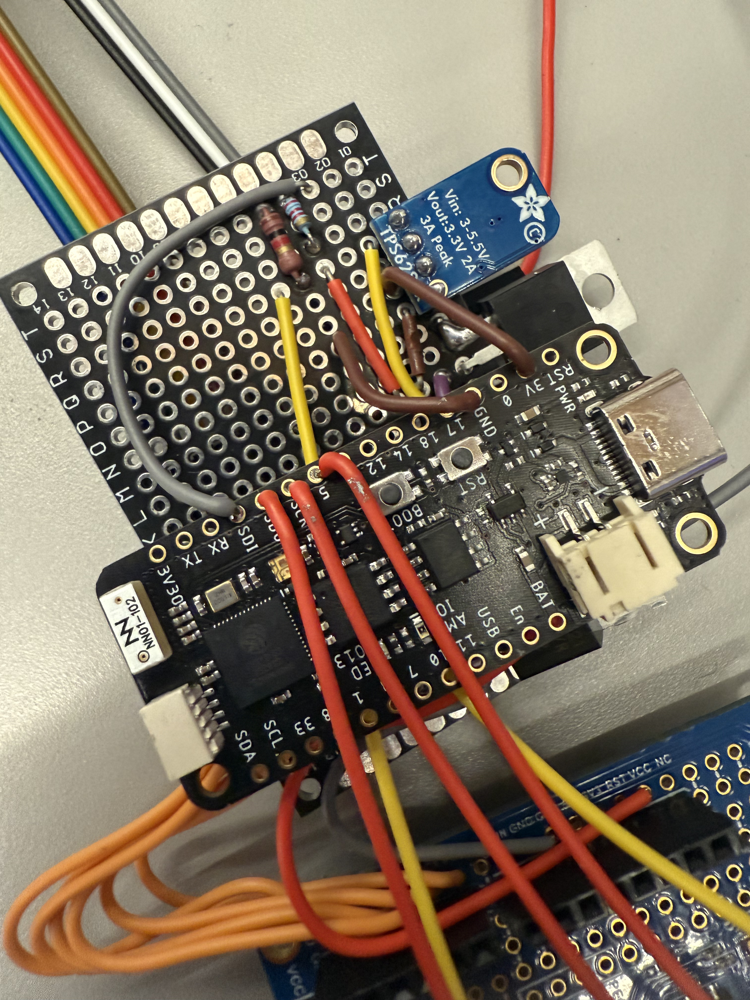

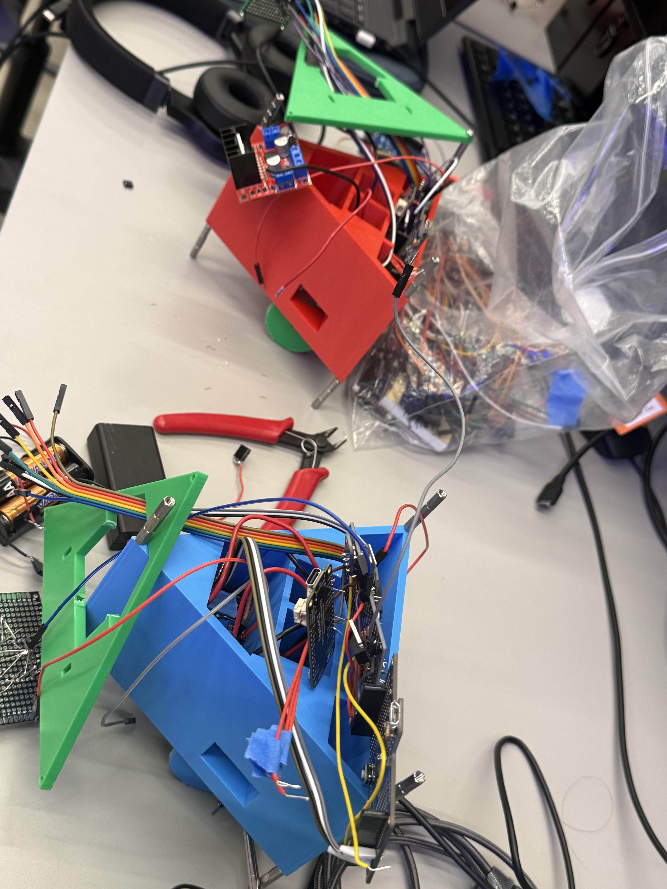

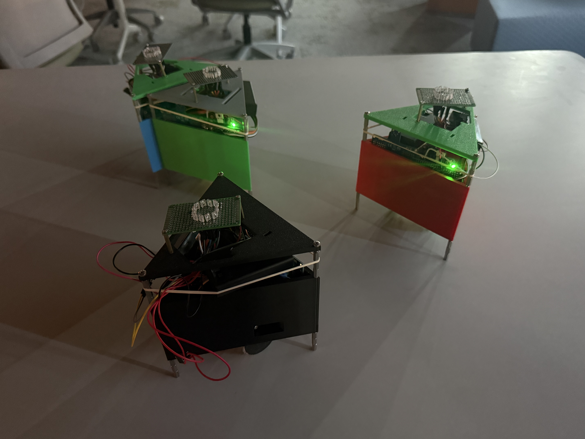

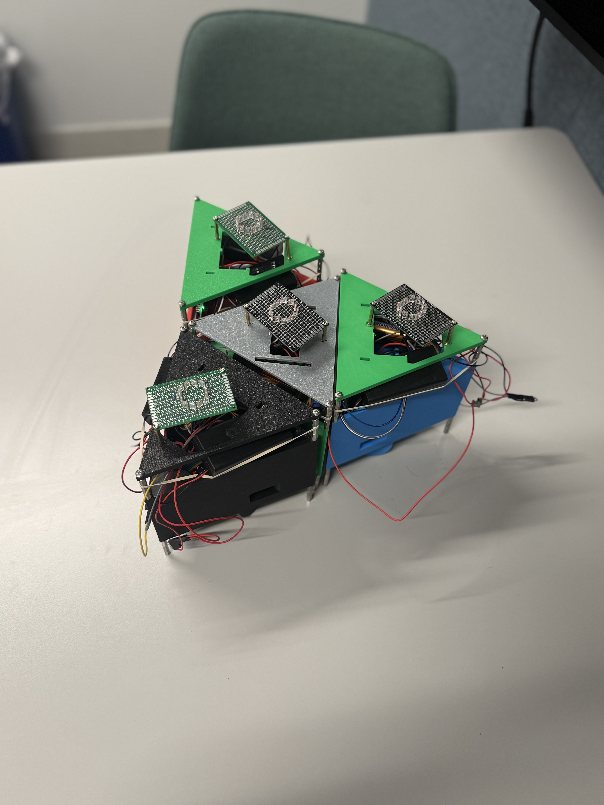

3. Results

#### 3.1 Software Requirements Specification (SRS) Results

| ID     | Description                                                                                                                                                                                                                                                                                                                                                   | Validation Outcome                                                                                                                                                                                            |
| ------ | ------------------------------------------------------------------------------------------------------------------------------------------------------------------------------------------------------------------------------------------------------------------------------------------------------------------------------------------------------------- | ------------------------------------------------------------------------------------------------------------------------------------------------------------------------------------------------------------- |
| SRS-01 | Each robot shall be capable of moving in at least 4 distinct directions (forward, backward, left, right) by independently controlling its wheel motors. Validation: command each direction and confirm correct motion visually and by observing displacement.                                                                                                 | **Confirmed.** All four directions commanded and visually verified on a hard flat surface; each robot displaced correctly in response to motor commands.                                                |
| SRS-02 | Each robot shall measure the ambient IR level using a photoresistor immediately before transmitting its IR signal, subtract the ambient value from the received signal strength, and report a corrected inter-robot distance within ±1 cm. Validation: compare reported distances against a ruler at known separations (1, 3, 5, etc. cm).                   | **Confirmed.** Ambient subtraction implemented; corrected ADC readings mapped to distance estimates within the ±1 cm bound across tested separations.                                                  |
| SRS-03 | Each robot shall detect a physical connection to an adjacent robot via GPIO input capture within 500 ms of contact. Validation: manually connect robots and confirm a connection-detected flag is set within the time bound, logged to terminal.                                                                                                              | **Not required.** As robots moved into proximity, their flat triangular faces aligned flush naturally as they drove into contact. Discrete connection-detection logic was not needed in practice.       |
| SRS-04 | Each robot shall transmit its sensor data (IR distance readings, connection state) to the main MCU over the radio link within 200 ms of being polled. Validation: log timestamps of poll and receipt on both sides and confirm the latency bound is met across 20 trials.                                                                                     | **Confirmed.** End-to-end poll latency (Main ATmega → Main ESP32 → Sub ESP32 → Sub ATmega → back) measured well within 200 ms across 20 trials.                                                     |
| SRS-05 | The main MCU shall poll each robot one at a time, receive its data, and construct a graph of relative robot positions (nodes = robots, edges = adjacent pairs, edge weights = corrected IR distance) within 1 second of initiating a polling cycle. Validation: print the adjacency graph to a terminal and verify correctness against known physical layout. | **Confirmed.** Main ATmega polled all robots, received IR distance data, and constructed the adjacency graph within 1 second; graph printed to terminal and verified against the known physical layout. |
| SRS-06 | The main MCU path-planning algorithm shall compute a valid movement instruction set for all robots to reach their target shape positions and transmit those instructions within 3 seconds of completing graph construction. Validation: log computed instructions and measure time from graph completion to first instruction sent.                           | **Confirmed.** Path-planning algorithm computed and transmitted movement instructions within 3 seconds of graph completion; logged instruction sets verified against target formation.                  |
| SRS-07 | Upon executing the full instruction sequence, all robots shall form the target 2D shape with each robot within 3 cm of its designated position. Validation: observe the final configuration visually and measure positional error for each robot against the intended layout.                                                                                 | **Confirmed.** All robots successfully assembled into the target 2D shape; final positional error for each robot measured within 3 cm of its designated slot.                                           |

#### 3.2 Hardware Requirements Specification (HRS) Results

| ID     | Description                                                                                                                                                                                                                                                                                                                 | Validation Outcome                                                                                                                                                                                                       |
| ------ | --------------------------------------------------------------------------------------------------------------------------------------------------------------------------------------------------------------------------------------------------------------------------------------------------------------------------- | ------------------------------------------------------------------------------------------------------------------------------------------------------------------------------------------------------------------------ |
| HRS-01 | Each wheel motor shall produce sufficient force to displace the robot on a hard, flat surface in a commanded direction within 0.5 seconds of activation. Validation: activate each motor individually and in combination on a hard floor and confirm directional displacement.                                              | **Confirmed.** Both motors tested individually and in combination; robot displaced directionally on a hard flat surface within 0.5 seconds of activation.                                                          |
| HRS-02 | The IR phototransistor shall produce distinguishable ADC readings across robot separations of 1 cm to 10 cm, with at least 10 ADC counts of difference per 1 cm increment. Validation: place two robots at known distances and record ADC values, verifying monotonic change with distance.                                 | **Confirmed.** ADC readings recorded at known separations from 1–10 cm; values changed monotonically with at least 10 ADC counts per centimeter across the tested range.                                          |
| HRS-03 | The nRF24L01+ radio transceiver shall maintain reliable packet communication (less than 5% packet loss) at a range of at least 5 meters. Validation: send 100 packets at 5 m separation and count dropped packets.                                                                                                          | **Confirmed.** ESP-NOW (used in place of nRF24L01+) maintained reliable communication at 5 m; fewer than 5% packet loss observed across 100 transmitted packets.                                                   |
| HRS-04 | The neodymium magnets shall hold two connected robots together under normal wheel motor operation, but allow separation when both motors on one robot are driven at full power. Validation: connect two robots and confirm they remain joined during normal motion, then drive motors at full power and confirm separation. | **Not required.** As robots drove into position their flat triangular faces aligned flush on contact; magnetic latching was unnecessary and magnets were not installed.                                            |
| HRS-05 | The conductive connection plates shall produce a GPIO logic HIGH on the receiving robot within 200 ms of physical contact between two robot faces. Validation: manually press two robot faces together and measure time from contact to GPIO flag via oscilloscope or terminal log.                                         | **Not required.** Robots became flush naturally as they drove into position; contact-plate detection was not needed and plates were not installed.                                                                 |
| HRS-06 | The two LDOs shall maintain stable 3.3V output under full load (all motors and radio active simultaneously) with less than 100 mV of ripple. Validation: measure output voltage with a multimeter and oscilloscope while running all components simultaneously.                                                             | **Confirmed (modified).** A buck converter was used in place of the LDOs. Output voltage measured with a multimeter and oscilloscope under full load (all motors and radio active); ripple remained within 100 mV. |
| HRS-07 | The battery supply (3x AAA) shall sustain full system operation for at least 10 minutes without voltage dropping below 3.6V at the LDO inputs. Validation: run all components continuously and log supply voltage over time.                                                                                                | **Confirmed.** Battery sustained full system operation for at least 10 minutes; supply voltage logged continuously and remained above 3.6V at the regulator input throughout the test.                             |

### 4. Conclusion

The swarm robotics system successfully demonstrated autonomous shape assembly from arbitrary starting positions. Four robots, each equipped with wheel motors, IR proximity sensing, and ESP-NOW wireless communication, were coordinated by a central ATmega328PB controller to form a target 2D shape without manual intervention after the initial command.

Several design adaptations were made during development. The original design used vibration motors for locomotion, but we switched to DC wheel motors which gave us far more reliable and controllable directional movement. The originally planned nRF24L01+ radio was replaced by ESP-NOW, which proved more reliable and simpler to integrate at the required range. LDO regulators were replaced with a buck converter for better efficiency under full motor load. The magnetic latching and contact-plate detection systems turned out to be unnecessary: as robots drove into contact their flat triangular faces aligned flush naturally, producing stable physical alignment without dedicated detection hardware.

The primary challenge was integration. Combining locomotion, IR sensing, wireless communication, and path planning into a coherent real-time control loop. Individual subsystems worked well in isolation but required careful timing and parameter tuning to operate together reliably. Future improvements could include closed-loop motor control with encoders for more precise positioning, a more robust localization method beyond IR proximity, and scaling the swarm beyond four robots.

## References

- Espressif Systems. *ESP-NOW Protocol Documentation*. https://docs.espressif.com/projects/esp-idf/en/latest/esp32/api-reference/network/esp_now.html
- Microchip Technology. *ATmega328PB Datasheet*. https://ww1.microchip.com/downloads/en/DeviceDoc/40001906A.pdf
- Arduino. *Arduino ESP32 Core*. https://github.com/espressif/arduino-esp32
